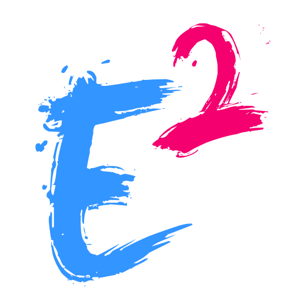

# E2Q

[E2Quant](https://github.com/E2Quant) 是一个交易回测框架，仿真现实中整个交易系统，整个框架由：交易所(OMS), 券商(Broker), 交易者(Trader)三部分组成.

- 采用 ticket 报价: Price/Time 算法
- 可选择 AB book 方式
- 利用多进程多线程快速回测各种临界条件
- Trader 与 OMS 之间采用 FIX Protocol

---

## 思维图如下:

## 功能特性

- 🚀 事务机制，按单笔 ticket 报价
- 🔧 本地回测
- 🛡️ A Book 机制，抛单到上游，完成真实的交易
- ⚡ E2L 语言开发策略

## 快速开始

### 先决条件

- 列出运行环境需求（如 Debian Ubuntu）
- 需要预装的工具（llvm-14+, quickfix17,libpq5 等）

### 系统依赖

- PostgreSQL 数据库记录订单
    - 可选择各种高级别的订单分析系统，比如：BI
    - 做各种收益的分析

- Kafka 处理报价
    - 多品种同一时间实行对齐报价
    - Log Debug 分析
    - Alert 订单报警机制

### 运程流程

- 读取报价: C++ [ITCH](https://github.com/E2Quant/e2q_ticket/tree/main/ITCH) or python [TickForPy](https://github.com/E2Quant/e2q_ticket/tree/main/TickForPy)
- 发送报价进入 kafka
- E2Q 主程序从 kafka 接到到报价 (参数 -s oms.e2) 参考: [Quickstart](https://github.com/E2Quant/e2q_doc/blob/main/docs/Quickstart.md), 进行订单撮合 并且 通过( [FIX Protocol](https://www.fixtrading.org/) ) 发送报价到名个 节点 
- 节点 EA (-e ea.e2) 进行策略定制，如果有 new  order, 通过 [FIX Protocol](https://www.fixtrading.org/) 返回 主程序
- 订单记录到 PostGreSql 数据库
- BI 软件系统进行订单分析

[完整可正式使用的案例](https://github.com/E2Quant/e2q_usage)

### 文档

- 访问 Wiki 查看[完整文档](https://github.com/E2Quant/e2q_doc)
- 在线文档[e2q-doc](https://e2q-doc.readthedocs.io/)

### 🤝 参与贡献
我们欢迎任何形式的贡献！请先阅读 贡献指南

### 贡献流程：

1. Fork 项目
2. 创建 feature branch (git checkout -b E2Quant/e2q.git)
3. 提交修改 (git commit -m 'Add some Feature')
4. 推送分支 (git push origin feature/Feature)
5. 发起 Pull Request

### 路线图
- [x] 已完成功能
- [ ] 计划中的功能
- [ ] 未来设想

### 引用以下论文或技术
- Price dynamics in a Markovian limit order market (arXiv:1104.4596)
- A Stochastic Control Approach to Bid-Ask Price Modelling (arXiv:2112.02368v1)
- M. Thompson, D. Farley, M. Barker, P. Gee, A. Stewart, Disruptor: High performance alternative to bounded queues for exchanging data between concurrent threads, Technical Report, LMAX, 2011. URL: https://lmax-exchange.github.io/disruptor/

### 许可证
本项目采用 BSD-3-Clause 许可证。

### 联系方式

- 有问题或建议？请通过以下方式联系我们：
    - 📧 Email: vyouzhi@gmail.com
    - Telegram: [@E2Quant](https://t.me/e2quant_from_github)

🐞  [Issue Tracker](https://github.com/E2Quant/e2q/issues) 
